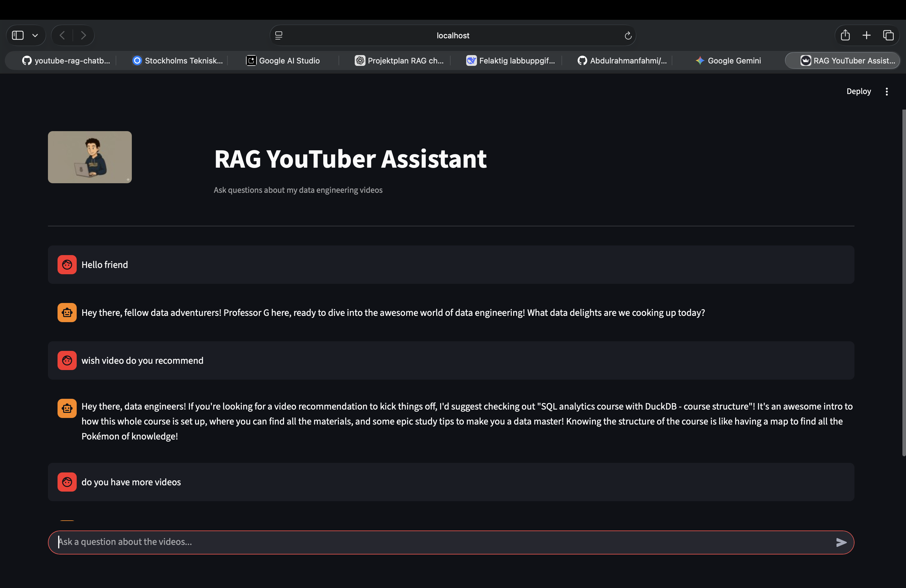
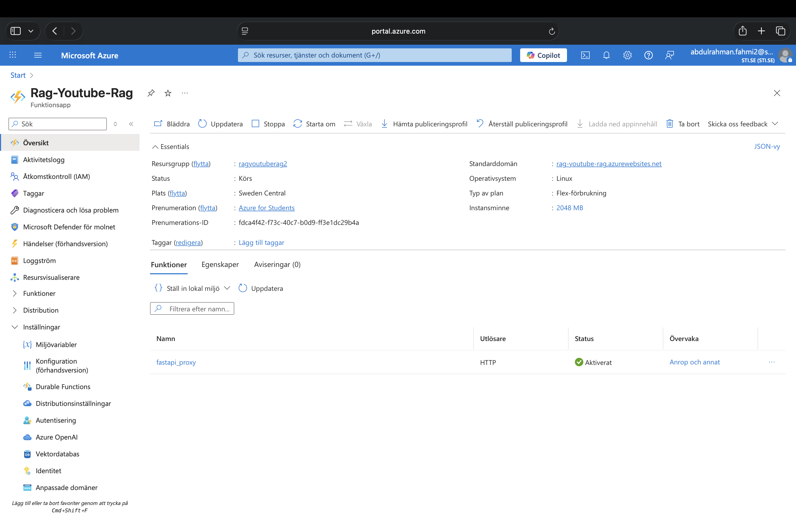
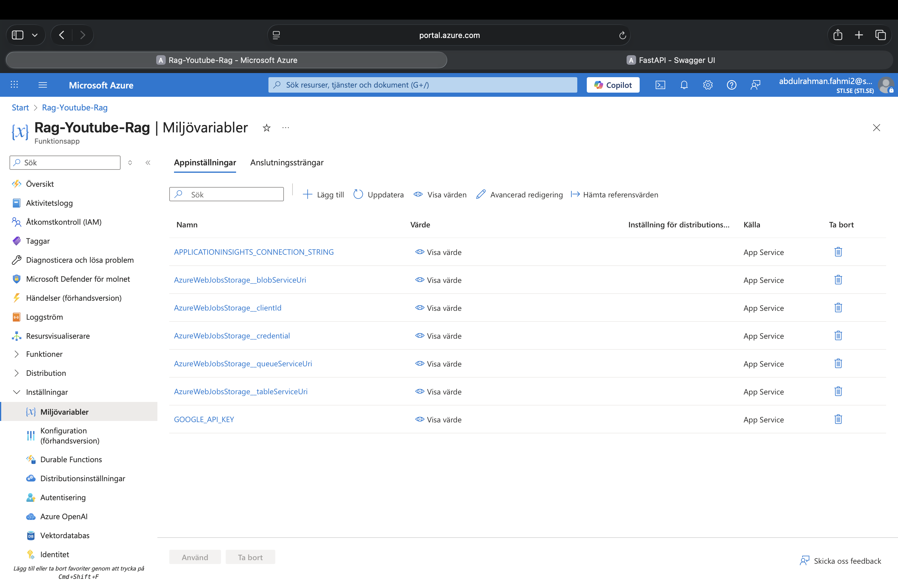
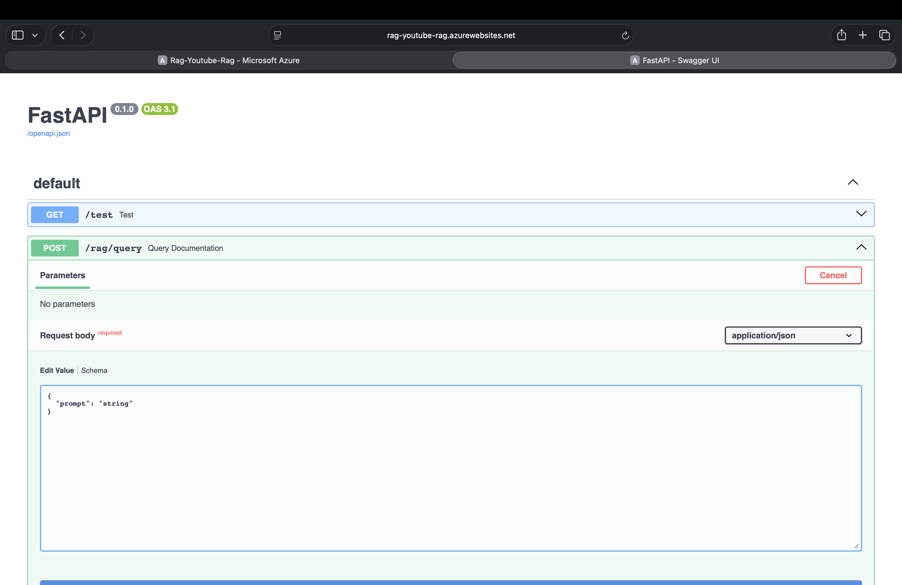

#  RAG YouTuber Assistant

En AI-driven RAG-applikation (**Retrieval Augmented Generation**) som svarar på frågor om data engineering-innehåll baserat på transkriptioner från YouTube-videor.

##  Översikt
Användaren kan ställa frågor som: *"Which SQL video should I watch?"*
Systemet fungerar genom att:
* Söka efter relevanta dokument i vektordatabasen.
* Hämta rätt kontext.
* Generera ett svar med hjälp av **Gemini AI**.

Detta säkerställer att svaren baseras på faktiskt innehåll och minimerar hallucinationer.

##  Vad är RAG?
RAG innebär att AI-modellen inte gissar, utan svarar utifrån lagrad data:
1. **YouTube-transkriptioner** → Skapar embeddings.
2. **Embeddings** → Lagras i LanceDB.
3. **Frågor** → Matchas semantiskt mot databasen.
4. **Svar** → Genereras med Gemini.

##  Arkitektur & Tech Stack
`[ Streamlit Frontend ]` ↔ `[ Azure Function (FastAPI) ]` ↔ `[ LanceDB Vector Store ]`

| Del | Teknik |
| :--- | :--- |
| **Frontend** | Streamlit |
| **Backend** | FastAPI |
| **AI** | Google Gemini (Embeddings & LLM) |
| **Vektordatabas** | LanceDB |
| **Serverless** | Azure Functions (Flex Consumption) |
| **Språk** | Python 3.12 |

##  Screenshots

### Streamlit Frontend


### Azure Function App – Running


### API Documentation


### Application Settings (API Key)



##  Projektstruktur
```text
.
├── api.py                 # FastAPI entry point för Azure Functions
├── function_app.py        # Azure Functions huvudkonfiguration
├── ingestion.py           # Script för att ladda data till LanceDB
├── backend/
│   ├── rag.py             # RAG-logik (Gemini + Vektorsökning)
│   ├── data_models.py     # Pydantic-modeller för API
│   └── constants.py       # Konfiguration och prompts
├── frontend/
│   └── app.py             # Streamlit UI-kod
├── data/
│   └── transcripts/       # Markdown-filer med transkriptioner
└── knowledge_base/        # Vektordatabas (LanceDB)

##  Köra projektet lokalt

### 1. Aktivera virtuell miljö
```bash
source venv/bin/activate

uv run ingestion.py

uvicorn api:app --reload

uv run streamlit run frontend/app.py

 Deployment i Azure
Backenden är driftsatt som en Azure Function App. API-nycklar hanteras via Application Settings.

 Publikt API: https://rag-youtube-rag.azurewebsites.net/rag/query

 API-dokumentation: https://rag-youtube-rag.azurewebsites.net/docs

 Reflektion
Det mest utmanande var integrationen mellan FastAPI och Azure Functions samt hantering av miljövariabler i molnet. Projektet har gett en djup förståelse för RAG-arkitektur och hur man sätter AI-system i produktion.

Författare: Abdulrahman Fahmi – Data Engineering Student
